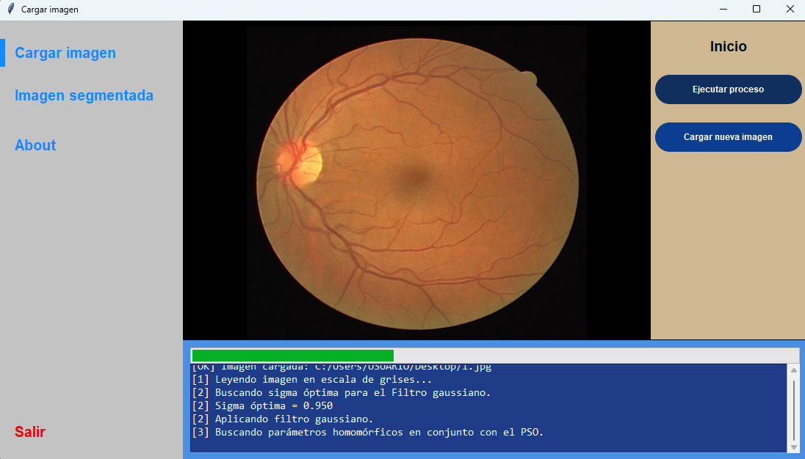
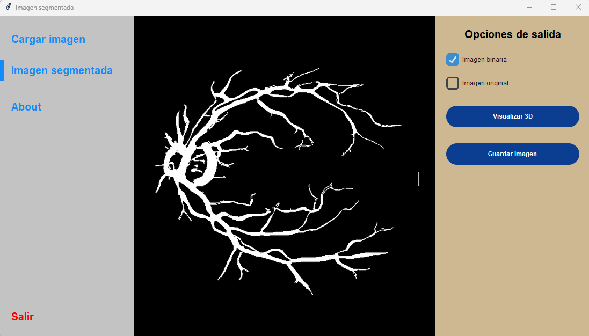
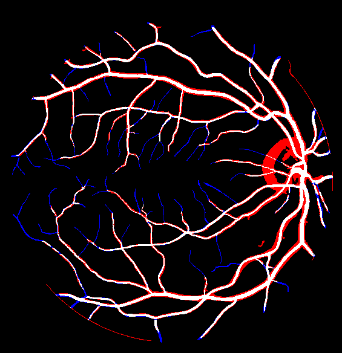

# 👁️ Retinal Blood Vessel Segmentation using Image Processing and Fractal Analysis

---

## 📋 Project Overview

Este proyecto de titulación propone un sistema para la segmentación de la red vascular retiniana en imágenes de fondo de ojo, utilizando técnicas de procesamiento de imágenes y análisis fractal para mejorar la visualización y extracción de vasos sanguíneos.

---

## 🎯 Objective

Desarrollar un sistema que permita segmentar la red vascular retiniana, abordando desafíos como:

- Bajo contraste
- Variaciones de iluminación
- Ruido en las imágenes
- Detección de vasos de distintos calibres

---

## 📊 Dataset

El proyecto utiliza bases de datos de imágenes de fondo de ojo para el análisis de la red vascular retiniana, incluyendo casos normales y con retinopatía diabética.

### ⚙️ Estandarización

Las imágenes fueron estandarizadas para unificar las condiciones de entrada del sistema.

| Categoría         | Detalles     |
|------------------|-------------|
| Resolución       | 595 × 633 px |
| Modelo de color  | RGB         |
| Formato          | JPG         |

---

## 🧠 Methodology

Se propone una metodología para la segmentación de la red vascular retiniana basada en técnicas de procesamiento de imágenes y análisis fractal.

### 🔄 Pipeline

El siguiente diagrama resume el flujo del sistema:

  

### 🔍 Etapas principales

- Preprocesamiento de imágenes  
- Mejora de contraste  
- Segmentación de vasos sanguíneos  
- Análisis fractal  

---

## 🖥️ Application Interface

El sistema cuenta con una interfaz gráfica que permite cargar imágenes de fondo de ojo, procesarlas y visualizar los resultados de segmentación. La interfaz fue desarrollada para facilitar la interacción con el sistema y permitir su uso en entornos no técnicos.

  
  
  

### 🔧 Funcionalidades

- Carga de imágenes retinianas  
- Visualización de la imagen segmentada  
- Generación de imagen binaria  
- Exportación de resultados  

---

## 📈 Results

El método propuesto permite una adecuada segmentación de la red vascular retiniana, incluso en presencia de ruido y variaciones de iluminación.

### 🔍 Ejemplo de resultado

  

### 📊 Métricas

- Precisión  
- Sensibilidad  
- Especificidad  

---

## 👨‍💻 Author

Desarrollado por Evelyn Bautista como parte de su proyecto de titulación en Ingeniería.

---

## 📄 License

Uso académico y educativo.